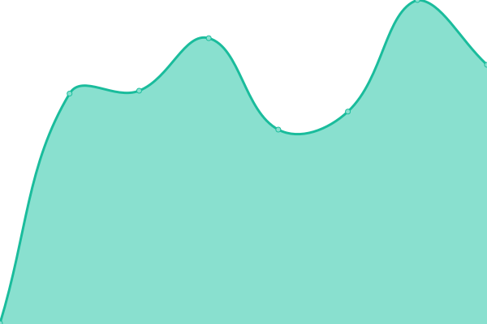
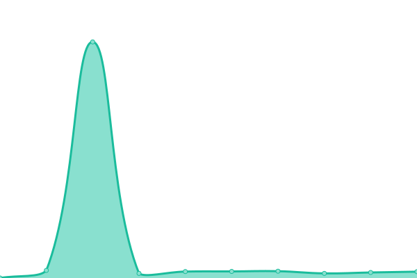
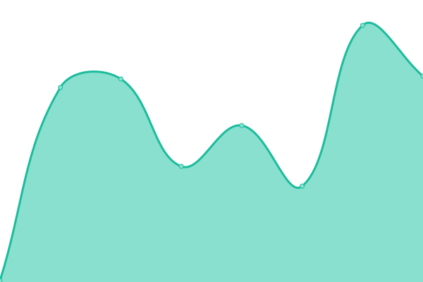
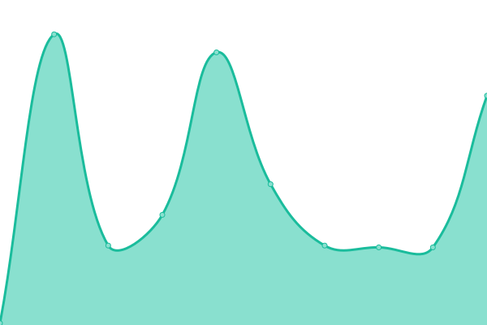
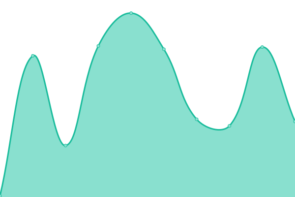

# [📈 Live Status](https://status.other.page): <!--live status--> **🟥 Complete outage**

This repository contains the open-source uptime monitor and status page for [CR3 Labs](https://cr3labs.com), powered by [Upptime](https://github.com/upptime/upptime).

With [Upptime](https://upptime.js.org), you can get your own unlimited and free uptime monitor and status page, powered entirely by a GitHub repository. We use [Issues](https://github.com/cr3labs/other-page-status/issues) as incident reports, [Actions](https://github.com/cr3labs/other-page-status/actions) as uptime monitors, and [Pages](https://status.other.page) for the status page.

<!--start: status pages-->
<!-- This summary is generated by Upptime (https://github.com/upptime/upptime) -->
<!-- Do not edit this manually, your changes will be overwritten -->
<!-- prettier-ignore -->
| URL | Status | History | Response Time | Uptime |
| --- | ------ | ------- | ------------- | ------ |
|  [Other Page App](https://portal.other.page) | 🟥 Down | [other-page-app.yml](https://github.com/CR3Labs/other-page-status/commits/HEAD/history/other-page-app.yml) | 

 260ms
     
 | 

<a href="https://status.other.page/history/other-page-app">99.76%</a>
    

|  [Other Page App API](https://api.other.page/core/v0/health) | 🟥 Down | [other-page-app-api.yml](https://github.com/CR3Labs/other-page-status/commits/HEAD/history/other-page-app-api.yml) | 

 229ms
     
 | 

<a href="https://status.other.page/history/other-page-app-api">100.00%</a>
    

|  [Other Page Portal](https://portal.other.page) | 🟥 Down | [other-page-portal.yml](https://github.com/CR3Labs/other-page-status/commits/HEAD/history/other-page-portal.yml) | 

 923ms
     
 | 

<a href="https://status.other.page/history/other-page-portal">99.77%</a>
    

|  [Other Page Portal API](https://api.other.page/portal/v1/health) | 🟥 Down | [other-page-portal-api.yml](https://github.com/CR3Labs/other-page-status/commits/HEAD/history/other-page-portal-api.yml) | 

 97ms
     
 | 

<a href="https://status.other.page/history/other-page-portal-api">100.00%</a>
    

|  [Other Page Public API](https://api.other.page/v1/health) | 🟥 Down | [other-page-public-api.yml](https://github.com/CR3Labs/other-page-status/commits/HEAD/history/other-page-public-api.yml) | 

 97ms
     
 | 

<a href="https://status.other.page/history/other-page-public-api">100.00%</a>
    

<!--end: status pages-->

[**Visit our status website →**](https://status.other.page)

## 📄 License

- Powered by: [Upptime](https://github.com/upptime/upptime)
- Code: [MIT](./LICENSE) © [Anand Chowdhary](https://anandchowdhary.com), supported by [Pabio](https://pabio.com)
- Data in the `./history` directory: [Open Database License](https://opendatacommons.org/licenses/odbl/1-0/)
